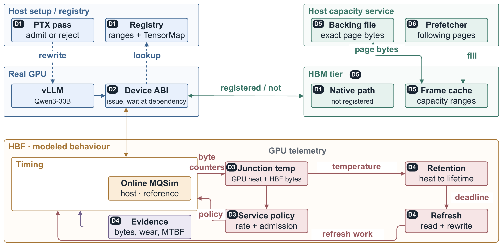

# HBFSim:让负载跑在真实 GPU 上,同时模拟 High-Bandwidth Flash

[SASS final147 复现包](reproduction/sass-final147-20260926/README.md)保存本轮实验实际使用的运行时源码、接口契约、构建步骤和固定请求验收证据；[上游 PR 审核](reproduction/sass-final147-20260926/upstream-review/REVIEW_SUMMARY.md)单独记录通用性限制。

[](https://opensource.org/licenses/Apache-2.0)
[](https://github.com/SlugLab/HBFSim/actions/workflows/ci.yml)
[](https://arxiv.org/abs/2609.09800)

[English](README.md) | **中文**

HBFSim 是一个面向 High-Bandwidth Flash(**HBF**)的评估平台。HBF 是一种把 NAND flash 堆进加速器封装的存储层。

HBF 在存储层次里位于 High-Bandwidth Memory(**HBM**)下面一层。HBF 目前买不到:第一份技术规范由 SanDisk 与 SK hynix 通过 Open Compute Project 在 2026 年 8 月 3 日发布,首批推理设备预计 2027 年初送样。

HBFSim 让应用照常在真实 GPU 上执行,并在执行过程中对这个应用施加 HBF 的时序、容量与温度效应,而不是先把访问序列记录下来、事后回放。

🚀 [快速开始](#快速开始) \
⚙️ [工作原理](#工作原理) \
📊 [HBFSim 已经量到什么](#hbfsim-已经量到什么) \
📄 [arXiv 上的论文](https://arxiv.org/abs/2609.09800) \
📝 [TODO.md 里还没做完的工作](TODO.md)

## HBFSim 回答的问题

服务一个大语言模型受限于内存容量。设计者要决定买多少 HBF 容量,或者决定哪些张量放进 HBF,这两个决策不能等硅片出来再做。现有的三种办法都定不下来:

- 回放已记录访问序列的存储模拟器从头到尾不执行负载;
- GPU 模拟器不运行真正的计算 kernel;
- cycle-accurate 模拟器跑不完一次大语言模型推理。

HBFSim 在负载于真实 GPU 上执行的同时,对这个真实的推理负载施加 HBF 的时序、容量与温度效应。

时序来自一台真实器件的实测数据,不来自参数表;结温同时决定 HBF 能维持的速率,以及触发刷新写入的数据保持期限。

## 快速开始

HBFSim 需要 Native Linux、CMake 3.25 或更新、Ninja、支持 C++20 的编译器、OpenSSL、Python 3。CUDA 部分需要 CUDA 12.8 或更新。

介质模拟器与介质模拟器的基准不装 CUDA 也能构建:

```bash
git clone https://github.com/SlugLab/HBFSim.git
cd HBFSim

HBFSIM_ENABLE_CUDA=OFF HBFSIM_ENABLE_MQSIM=ON ./scripts/bootstrap.sh
cmake --build build -j"$(nproc)"
ctest --test-dir build --output-on-failure
```

在一台没有 CUDA 的机器上:configure 通过,152 个构建目标全部构建通过,34 个测试里 31 个通过。[TODO.md](TODO.md) 记录了没通过的那三个测试,以及每个测试没通过的原因。

默认分支是 `main`,所以上面的 `git clone` 不需要 `--branch` 参数。


### 看一次运行

介质基准不需要 GPU。介质基准用确定性的顺序请求驱动在线 MQSim 参考模型,输出一份 JSON:

```console
$ ./build/hbf_mqsim_bench --profile configs/profiles/nominal.json \
    --requests 1024 --bytes 16384 --operation read --arrival-gap-ns 0
{
  "effective_profile": {
    "aggregate_bandwidth_bytes_per_s": 512000000000,
    "blocks_per_plane": 16,
    "capacity_bytes": 68719476736,
    "channels": 32,
    "hbm_cache_bytes": 67108864,
    "nand_technology": "SLC",
    "plane_allocation_scheme": "CWDP",
    "program_latency_ns": 100000,
    "read_latency_ns": 10000
  },
  "engine": "mqsim-hbf-media-only",
  "latency_ns": { "average": 170115, "p50": 164960, "p99": 329920 },
  "modeled_bandwidth_bytes_per_s": 50852376333.65665,
  "requests": { "completed": 1024, "submitted": 1024 },
  "simulator_requests_per_s": 6557.51045857279,
  "timing_ns": { "modeled": 329920, "wall": 156156823 }
}
```

最后两个字段要放在一起读。`timing_ns.modeled` 是 HBFSim 算出来的器件时间,`timing_ns.wall` 是算这件事本身花掉的时间。

HBFSim 在任何地方都把这两个数分开报告,因为一个模拟器可以功能上完全正确,而模拟器自身的开销比它正在建模的延迟还大。

<div align="center">
  
  <p><em>HBFSim 做的事情,从左往右读。主机侧的初始化与注册表用 PTX pass 改写模块,再记下哪些地址区间被注册成 HBF。一块真实 GPU 通过 device ABI 在 Qwen3-30B 上运行 vLLM。在高带宽内存这一层,访问未注册的地址留在原生路径上,访问注册过的地址由 frame cache 供给。主机容量服务从承载文件里取出准确的 page 字节,prefetcher 顺带把后面几个 page 读进来。右边是 HBFSim 算出来的 HBF 行为:在线 MQSim 参考模型给出时序;结温同时决定 HBF 能维持的速率与数据保持期限;期限逼近就必须做刷新,也就是先读一遍再重写一遍;服务策略决定速率与准入;证据输出记录字节数与磨损。</em></p>
</div>

## 工作原理

三个机制撑起整个设计。

1. **显式注册的地址区间决定意图。** 只有应用或运行时注册过的地址才被当成 HBF。普通的 HBM 指针留在原来的快路径上,不受影响。

2. **改写 PTX 取得可见性。** 一条由 bpftime 与 eGPU 派生出来的拦截路径自动改写受支持的 global load 与 store 指令,不需要手工改任何一个 CUDA kernel。PTX 是 NVIDIA 编译器生成的中间代码。

   有一道覆盖闸门:任何 HBF 指针一旦进入行为无法被证明安全的代码,这次 kernel 启动直接被拒绝,而不是悄悄放过。

   构建会检查改写后的模块是自包含的,并用 CUDA 12.8 的 `ptxas` 汇编这个模块;这仍然是静态证明,不是在真实 GPU 上注入过延迟的证据。

3. **详细路径与快速路径并用。** 在线的、只建模介质的 MQSim 路径是详细参考模型。经过标定的 GPU 本地模型承担常见路径,抽样请求把 GPU 本地模型锚回 MQSim。

   MQSim 在这里当 flash 介质模型用,不当 SSD 主机栈模型用。

HBFSim 把四种时间分开报告:建模的器件时间、主机服务时间、墙上时间,以及 HBFSim 自身的开销。

把四种时间分开报告很要紧,因为 HBFSim 可以功能上完全正确,而 HBFSim 自身的软件开销比 HBFSim 正在建模的器件延迟还大。

## 两种模式

| 模式 | 改变了什么 | 回答的问题 |
|---|---|---|
| **Timing-only** | 数据仍然留在普通 GPU 显存里,HBFSim 只对注册过的访问注入建模延迟。 | 当前负载对 HBF 的延迟、bandwidth 与争用有多敏感? |
| **Capacity** | 注册的数据由文件承载,经过一个有界的、放在 GPU 显存里的 page cache 分页进出。 | 工作集大于 GPU 显存时,当前负载还跑不跑得动,cache 行为是什么样? |

两种模式共用同一套显式注册区间、同一套 PTX 覆盖规则、同一批命名 HBF profile 和同一个报告模型。

在 Capacity 模式下,一个上下文里每个注册过的文件区间共享同一个有界 HBM page cache。

命中直接落到常驻的 HBM frame;未命中要把承载 page 读进来,贡献一次建模的介质读;脏页淘汰在这个 page 的字节写回承载文件之前,贡献一次建模的介质编程。

## HBFSim 已经量到什么

- **六个标定断点全部精确吻合。** 实测 P50 延迟与建模值在 1、4、16、64、256、512 个连续 4 KiB page 上逐点相符,硬件是 NVIDIA RTX PRO 6000 Blackwell Server Edition,driver 595.84。

  这是确定性标定检查,不是交叉验证:六个点全部参与了拟合,没有一个被留出来。出处:[`docs/proofs/2026-08-11-cd8p-vmem-tuning.md`](docs/proofs/2026-08-11-cd8p-vmem-tuning.md)。

- **快速路径比详细参考路径快 20.8 倍。** 在同一个确定性的 Qwen3-30B 用例上,参考路径用了 44.469 s,快速路径用了 2.014352 s,两次运行生成的 token 标识符完全一致。

  20.8 倍是 HBFSim 两条路径的墙上时间之比,不是对 HBF 硬件性能的预测。出处:[`docs/proofs/2026-08-11-hybrid-complete.md`](docs/proofs/2026-08-11-hybrid-complete.md)。

- **在未经改动的 vLLM 上注入延迟,输出逐 token 不变。** vLLM 0.15.1 服务 Qwen3-30B 时,2,304 次 `fused_moe_kernel` 启动里有 24 次是建模启动,输出的 token 标识符与基线一致。

  只注册了一个张量的前 16,384 字节,而这个张量一共 61,064,245,248 字节。出处:[`docs/proofs/2026-08-11-vllm-exact-live-delay.md`](docs/proofs/2026-08-11-vllm-exact-live-delay.md)。

- **110 GiB 的逻辑地址范围跑在一块 97,887 MiB 的 GPU 上。** 110 GiB 逻辑地址范围配 2 GiB HBM cache,128 次访问全部完成,产生的 checksum 是 `14245581564465502923`,与基线产生的 checksum 相同,不安全启动 0 次。

  这是稀疏的逻辑容量证明,不声称 110 GiB 被物理读过。出处:[`docs/proofs/2026-08-11-hybrid-complete.md`](docs/proofs/2026-08-11-hybrid-complete.md)。

- **温度改变同一块 GPU 的行为。** 同一个 BF16 8192x8192 矩阵乘,在温度从 35 升到 70 degrees C 的冷机独占运行里达到 379.117 TFLOP/s,在温度从 61 升到 85 degrees C 的热机独占运行里只有 348.427 TFLOP/s,相差 -8.10%。出处:[`docs/proofs/2026-08-10-live-gpu-cd8p-thermal.md`](docs/proofs/2026-08-10-live-gpu-cd8p-thermal.md)。

- **时序模型由一台真实器件标定而来。** 标定源是一块通过 PCIe 5.0 32 GT/s x4 接入的 Dell DC NVMe CD8P E3.S 1.92TB。

  这块 Dell CD8P 是普通 PCIe NVMe 端点,不是 CXL 端点。

构建通过、CPU 测试通过、MQSim 回归通过,加上 PTX 汇编成功,这四件事都不构成真实 GPU 上的证据。

## HBFSim 与其它几种办法的对比

下面每一种办法都有 HBFSim 不去做的长处。

回放已记录访问序列的存储模拟器便宜、可重复,而且不需要加速器。GPU 模拟器给出的微架构细节是 HBFSim 从来看不到的。在小 kernel 上,cycle-accurate 模拟器是正确性的参照。厂商参数表则是唯一能拿到的描述,因为厂商之外没有人量过 HBF 这个器件。

| 办法 | 执行真实负载 | 跑在真实硬件上 | 建模介质 | 建模温度 |
|---|:---:|:---:|:---:|:---:|
| 回放已记录访问序列的存储模拟器 | ✗ | ✗ | ✓ | ✗ |
| 不运行真正计算 kernel 的 GPU 模拟器 | ✗ | ✗ | ✗ | ✗ |
| cycle-accurate 模拟器 | ✓ | ✗ | ✓ | ✗ |
| 厂商参数表 | ✗ | ✗ | ✗ | ✗ |
| HBFSim | ✓ | ✓ | ✓ | ✓ |

读这张表要留意两点。

第一,每一行写的是办法,不是具体产品,所以某个具体工具有可能多出表里那四项能力中的一项。

第二,cycle-accurate 模拟器确实执行负载,但是跑不完一次大语言模型推理,所以第一列上的那个对勾并不能替这一行下结论。

## 命名 HBF profile 与构建选项

| Profile | Page | 读 | 编程 | 通道数 | Queue depth | 总带宽上限 |
|---|---:|---:|---:|---:|---:|---:|
| `conservative` | 16 KiB | 20 us | 200 us | 16 | 64 | 128 GB/s |
| `nominal` | 16 KiB | 10 us | 100 us | 32 | 128 | 512 GB/s |
| `aggressive` | 16 KiB | 5 us | 50 us | 64 | 256 | 1 TB/s |

第四个 profile `cd8p-vmem-p50` 不是合成的:`cd8p-vmem-p50` 的取值由 Dell CD8P 的实测延迟曲线标定而来,而这条曲线标定的是完整的实测软件路径,包含这条路径自身的软件开销。

表里那三个 profile 是为探索设计空间而明确标注出来的假设;Open Compute Project 的 HBF 规范已经发布,但是规范发布并不能说明这三个 profile 已经按 HBF 硅片标定过。

四个 profile 都放在 `configs/profiles/` 下,由带类型的加载器对照 `configs/schema/hbf-profile.schema.json` 校验。

| 构建选项 | 默认值 | 用途 |
|---|---|---|
| `HBFSIM_ENABLE_CUDA` | `ON` | 构建 CUDA 插桩与运行时组件 |
| `HBFSIM_ENABLE_MQSIM` | `ON` | 构建由 MQSim 支撑的主机服务 |
| `HBFSIM_ENABLE_LLM_TESTS` | `OFF` | 启用 llama.cpp 与 vLLM 集成测试 |
| `HBFSIM_ENABLE_EVAL_TOOLS` | `OFF` | 构建离线评估模型与回放工具 |

## 仓库结构

- `src/` — 全部 C++ 与 CUDA 生产代码,分十个组件:CUDA 拦截运行时、PTX pass、主机服务、热学求解器、MQSim 适配层、profile 加载器、prefetch、报告、快速模型标定器、page 协议。
- `include/hbfsim/` — 公开头文件,以及跨越主机与设备边界的契约。
- `adapters/` — 三个集成适配层:`llama_cpp/`、`vllm/`、`vllm_capacity/`。
- `benchmarks/` — 测量驱动程序:CUDA 微基准、MQSim 介质基准、prefetch、trace 回放。
- `configs/` — 只放 JSON 固定数据:命名 HBF profile、三组参数扫描、热学固定数据、两份 JSON Schema。
- `scripts/` — bootstrap 入口、Python 评估框架、热学标定流水线。
- `tests/` — CPU 测试、集成测试、GPU 测试、PTX 固定数据。
- `tools/` — 独立的热学配置工具,只依赖 Python 标准库。
- `patches/` — 打给两个固定版本子模块的外部补丁。
- `third_party/` — 两个固定版本的子模块:bpftime 与 MQSim。
- `cmake/` — 子模块版本固定、PTX 嵌入,以及打过补丁的 MQSim 构建。
- `docs/` — 设计规格、实现计划、proof checkpoint、评估 runbook、参考论文。
- `todo/` — 待做实验清单,以及还要核实的事实清单。
- `paper/` — 一个与构建、测试都无关的子模块。`.gitmodules` 把 `paper/` 标成非激活,`scripts/bootstrap.sh` 只初始化两个构建依赖。

## 文档

- [`docs/proofs/`](docs/proofs/) — checkpoint 文档,每一个实验数字都在这里,每一个数字都连同命令与主张边界一起记录。
- [`docs/eval/`](docs/eval/) — 评估计划、负载方法学、复现 runbook。
- [`docs/skills/`](docs/skills/) — 一份阅读顺序,外加每个子系统一份文档,写给第一次读这套代码的人。
- [`docs/reference/`](docs/reference/) — 参考笔记,含 CUDA 架构兼容性审查。

## 论文与引用

描述 HBFSim 的论文在 [arXiv:2609.09800](https://arxiv.org/abs/2609.09800)。

```bibtex
@article{hu2026hbfsim,
  title   = {HBFSim: Fast and Faithful Simulation of High-Bandwidth Flash Under Real GPU Execution},
  author  = {Hu, Yanpeng and Yang, Yiwei and Zhu, Yuanwu and Zheng, Yusheng and Zhang, Wei and Quinn, Andi},
  journal = {arXiv preprint arXiv:2609.09800},
  year    = {2026}
}
```

`CITATION.cff` 里是同一条引用,GitHub 据此在仓库页面上显示 "Cite this repository" 按钮。

## 参与贡献

缺陷报告与功能请求走 [`.github/ISSUE_TEMPLATE/`](.github/ISSUE_TEMPLATE/) 里的模板,pull request 按 [`.github/pull_request_template.md`](.github/pull_request_template.md) 提交。

提 pull request 之前,先按上面的快速开始构建并测试一遍,并在 pull request 里写清楚给出的测量属于四种时间里的哪一种。

参与方式受 [行为准则](CODE_OF_CONDUCT.md) 约束。报告安全漏洞请按 [`SECURITY.md`](SECURITY.md) 的办法,不要开公开 issue。

## 许可证

HBFSim 以 Apache License 2.0 发布,完整条款见 [`LICENSE`](LICENSE)。

## 致谢

HBFSim 建立在两个项目之上,并且把两个项目都作为固定版本的子模块保留。bpftime 以 MIT 许可证发布,提供了 PTX 改写所派生自的拦截路径。

MQSim 由 SAFARI Research Group at ETH Zurich 以 MIT 式许可证发布,提供 flash 介质模型,HBFSim 通过一个外部补丁在线驱动这个介质模型。
