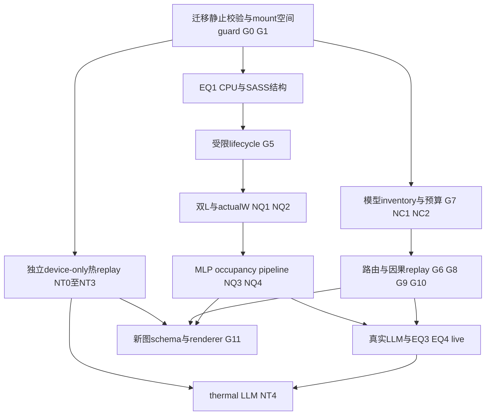

# Incremental execution plan，2026-09-08

本轮范围是迁移、关键审计、文档同步和最小CPU检查；没有授权启动完整新矩阵、合并候选或升级ABI。[主规范](../49-new-evaluation-plan.md)定义新EQ，[run matrix](run-matrix.csv)逐cell列真实入口或BLOCKED；预算以下均为待pilot的硬上限，不是测得成本。旧矩阵和原始失败见[历史入口](history/20260905/README.md)，不覆盖历史数值。

## 启动、预算和资源合同

每组先检查迁移manifest、目标mount/device UUID及空间低水位，确认logical/physical路径；使用本任务launcher隔离TMPDIR/HF_HOME/XDG_CACHE_HOME/TRITON_CACHE_DIR/CUDA_CACHE_PATH/TORCH_EXTENSIONS_DIR及实际栈缓存，不改global profile。记录source/build/env/profile/model/trace/renderer hash、资源身份、seed、initial/cache状态与time_scale。只增量读取发生变化的输入，旧冻结证据不重复全量跑。

CPU_ONLY_SERIAL逐个重型进程，GPU_EXCLUSIVE同物理GPU只一个计时任务；重复制/编译/存储压测与敏感性能测量互斥。CPU文档/小静态检查可独立推进。每pilot设wall/RSS/output/model-time上限并采集实际wall/model-time、RSS、bytes/bin；后续预算按至少2倍工件增速误差预留，不删唯一trace维持运行。没有真实pilot不把上限写成“预计已足够”。

共同停止：mount丢失/错设备/低水位、hash/ABI/coverage/单位失配、checksum/stale/early/missing transaction、OOM、timeout、daemon-loss、资源污染即停止该cell扩张，保存raw/partial/错误/owned-process身份；不杀他人进程，不变驱动/频率，不静默bypass。只有相应依赖被阻塞，其他独立审计继续。

## 依赖DAG

Accel-Sim SM120为可选BLOCKED，不成为其他锚点前置。device-only thermal不依赖GPU EQ1；thermal LLM必须同时通过GPU/app及热组合门。

## 预算唯一来源

机器矩阵的`pilot_wall_cap_seconds`、`pilot_rss_cap_MiB`、`pilot_output_cap_MiB`是每cell实际可注册上限。下表家族上限不能覆盖更紧的展开cell限制；如缺对应cell，组件候选不自动可执行。热首pilot使用`pilot_argv_json`（argv_json也指同一0.1s命令），4s/8s仅在`historical_replay_argv_json`保留，必须重新过预算门才可使用。所有上限均是规划而非实测资源。

## EQ1：先可识别机制，再并发和pipeline

当前C=`eval/eq1-eq4-implementation@254d65a66279fbaffc5c185d04fbe41dc8dbba44`。当前future只支持fast scalar TIMING、time_scale1、受限直线scalar，capacity/TMA/一般CFG未接通。精确ledger与本轮raw见[EQ1审计](review-evidence/20260908/eq1-audit.md)及[机器组](review-evidence/20260908/eq1-experiments.json)。不整体合并SM120/thermal donor。

| 组 | 真实入口 / 状态 | 参数、initial与配对 | 重复、pilot预算与停止 |
|---|---|---|---|
| Q-CPU / NQ1 | `tests/integration/test_future_emitter.py`配当前源码driver；本轮19/19；三例oracle3/3 | 固定PTX/memory fixture；L0=.5/L1=5us、W6/2/.2；值/predicate/守恒/拒绝 | 确定性1次；已测host compile11.80s、tests1.73s；CPU上限120s/1GiB/30MiB；无GPU时序主张 |
| Q-SASS | `scripts/eval/audit_sass_mapping.py --cubin --ptx --build-manifest --out --cuda-bin`；通用native基准BLOCKED | 同kernel native/zero/old/deferred、优化cubin；warm/cold分开且规则冻结 | 每build映射1次；CPU5min/2GiB/1GiB输出上限；load被消除/首use不明则停 |
| Q-LIFECYCLE | `scripts/eval/run_c6_future_lifecycle_correctness.py --execute --out --build-dir --profile --ptx --cubin --gpu-uuid`；READY_AFTER_BINDING | 同run accepted mapping/完整参数，mode覆盖overwrite/consume/ret；fresh输出/初始内存/有限trace | pilot3 paired launches，GPU120s/2GiB host RSS/128MiB输出；冻结后至少10独立paired launches；wrong binding/error不算PASS |
| Q-OVERLAP | `scripts/eval/run_c6_future_delay_overlap.py`窄入口真实；通用D/W **BLOCKED_HARNESS** | 现有仅D0/20us、K0/4096；新D0/.5/1/2/5/10/20us；actualW在实测L0/L1两侧，time_scale1；四臂同输入 | pilot3对，GPU120s/2GiB host RSS/128MiB；实际W不变或D全在W前过期为NON_IDENTIFYING，先修W不只增D |
| Q-MLP | **BLOCKED_HARNESS + NQ2** | QD/MLP1/2/4/8/16/32，低/中/高achieved occupancy，正交切片；相同cache/频率状态与四臂 | 3对pilot；GPU5min/2GiB host/256MiB；held-out资源点偏差不明则收窄 |
| Q-SLOW | **BLOCKED_PLATFORM_CAPABILITY_AND_HARNESS** | native device/mapped-pinned host LDG；先合法platform能力检查；warm/cold、held-out W/MLP | 3对pilot，GPU120s/2GiB host/128MiB；不支持立即停可选路径，不推广TMA/atomic/HBF |
| Q-TMA | **BLOCKED_RUNTIME**；parser非runtime | G→S phase/arrival/expect_tx/try_wait/test_wait、多warp/stage；S→G read-wait后覆盖源、独立目标可见；group N0/1，legal multicast、A→B/fence/mixed-range/capacity tile寿命 | 每case5功能重复，GPU120s/2GiB host/128MiB初始上限；任何early/stale/missing/timeout失败关闭；未实现不启动 |
| Q-PIPELINE | **BLOCKED_KERNEL_AND_NQ4** | 兼容CUTLASS/Triton double-buffer GEMM/MoE；actualasync/forced-serial；stage/window/fanout合法点 | 3对pilot，GPU5min/2GiB host/256MiB；buffer reuse/多outstanding先正确再测性能 |
| Q-SIM | **BLOCKED_OPTIONAL_SM120** | Accel-Sim v2.0.0发布Hopper/TMA/multicast，SM120不在已发布支持域 | 不无限安装/移植；若将来有真实支持，少量kernel、CPU5min/2GiB/1GiB pilot，不用H100/B200当SM120校准 |

native/zero/old/deferred的issue_block、consume_residual、total_exposed、Event、host wall分别记录；主oracleDeltaS=[L1-W]+-[L0-W]+，extraD满足L1=L0+D。native保留时不能重复支付native读延迟，capacity fill后的native尾延迟另列。检查当前emitter在native load后rawbits/nativebits转换是否在最终SASS提前消费；仅PTX不能定论。

pilot冻结最小可分辨D、absolute error ns/us阈值、paired重复数和held-out split。正式至少10独立paired launches；若CI宽度不足，增加到预注册上限后仍不足记INCONCLUSIVE。随机/ABBA次序+seed，warp lanes不是重复；near-zero不用MAPE，报bias/median/p95/paired CI。profiling与正常计时分run。

旧issue-stall工具`run_gpu_delay.py`/`run_known_delay_per_chain_abba.py`可保留诊断，但需要其原cell及`--matrix docs/49-eval-audit/history/20260905/run-matrix.csv`（仅接受该flag的runner），不能默认把新矩阵喂旧parser。精确入口flags由已保存`--help`与原binding决定；新matrix adapter是独立补丁。本轮旧generator已要求显式--output新文件并拒绝覆盖，旧固定数量断言已绑定history；这仅是文档工具兼容保护，不改变runtime。

## EQ2：独立device-only先行，真三臂缺口明确

P=`prototype-revalidation/sources/diagnostics/cell-c-phase2-adaptation-001@49f9b2daa60271b39085de8cbc98180b6aead297`，与C无共同祖先。真实CPU入口为`/root/hbfsim-exp/prototype-revalidation/builds/cell-c-phase2-adaptation-001/phase2_thermal_load_runner`，参数为`--device-profile --package-profile --model --output --duration-ns --offered-byte-rate --peak-byte-rate --request-bytes --queue-depth --seed --arrival-mode --workload --pattern`。stage在package JSON，**没有--thermal-stage runner flag**。完整argv/input哈希见[thermal cells](review-evidence/20260908/thermal-eq2-cells.json)，精确范围见[thermal audit](review-evidence/20260908/thermal-audit.md)。

| 组 | 入口/状态 | initial、参数与配对 | 重复、预算和停止 |
|---|---|---|---|
| T-CHECK | 历史hash/ROM/held-out核对与CPU timeline；本轮已执行，未重跑热load | 固定历史source/JSON/原始CSV；13结果+45引用、10golden等20检查；8Hi tau=.283248410s、16Hi=1.021309821s | 确定性核对1次；240行synthetic timeline约.27s；是历史验证/解析检查，不是新热物理测量 |
| T-REPRO | P runner，test-only shadow/active **READY_NOT_RUN** | `phase2-runtime-inputs-20260827T095943Z/g1-8hi-cl2-{shadow,active}/`；同device/ROM/初态，仅package name/stage差异；100MB/s offered、200MB/s peak、1MiB、QD128、seed21001、periodic/read/random | 首pilot1seed，.1s modeled/10bins，CPU serial120s wall/2GiB RSS/100MiB output；4s历史范围只在该ROM确认预算后；旧证据未变无需重复 |
| T-OFF | **BLOCKED_EQ2_TRUE_OFF_RUNNER** | 同P arrival/MQSim/queue路径真关闭ROM/采样/热计算；不能拿另一daemon off拼接 | 补丁后1seed no-threshold配对，预算同T-REPRO；off不应依赖有效ROM，shadow错误则拒绝 |
| T-NOMINAL | **BLOCKED_PHYSICAL_INPUTS + TRUE_OFF + USEFUL_COMPLETION_BINS** | 8Hi/16Hi；来源域未触限负对照/近边界/持续负载；off/shadow/active同source/env/初温/geometry/material/cooling/raw-demand/seed/capacity/media | 每cell1seed pilot，确认至少3独立seed/replicate；预算先同上，按实测增长外推≥5tau+窗口；deterministic重复无差异不造物理CI |
| T-REFRESH | **BLOCKED_REFRESH_DISPATCH_COMPLETION_ENERGY** | refresh需求→physical read/program→队列/完成→PEC/寿命→未来power；与controller开关分开 | 补丁后饱和/失败/恢复功能5次，CPU120s/2GiB/100MiB；counter不作已执行刷新、缺energy不能填零 |
| T-LIVE | **BLOCKED_EQ1_APP_TIMING_AND_COMBINATION_PARITY** | C当前无package runtime；同当前tree thermal-off parity、真实app依赖/计时后再加active | 3对pilot，GPU5min/4GiB host/256MiB output上限；NT4/G5/NQ2/G9未过只device-only |

nominal不直接复用test-only per-command能耗。OCP v0.7.0真实规范有GC不支持、refresh规则和thermal backpressure等约束，但硅片能耗未校准；TSV几何、XL-FLASH延迟与HBF目标带宽独立profile，拼接只PROJECTED。无可靠tR(T)不发明函数。旧64.5W/100MB/s不得线性外推TB/s。

horizon须≥5tau+预注册统计窗，核对温度斜率、queue漂移、offered/admitted/pending/inflight/completed守恒；预算不足停止重排，不用短run假稳态。初始campaign建议上限CPU30min/2GiB工件只是待审候选，不是本轮启动。保持10ms原始bins、T1先100ms固定窗口完成useful bytes，physical media/refresh/retry bytes另账；T2同模型时间轴shadow/active温度，off不伪造平线。旧analyzer只有合计media物理bytes，T1 exporter缺口必须先修。固定arrival与closed-loop到达分开，后者反馈改变后续arrival是机制结果。nominal无差异保留负结果。

## EQ3：先物理r，再HBM分配

| 组 | 真实入口/状态 | initial/参数/配对 | 重复/预算/停止 |
|---|---|---|---|
| C-INVENTORY | `scripts/eval/inventory_checkpoint.py CHECKPOINT --output FILE`；`budget_fast_tier.py INVENTORY --output --fast-bytes --active-sequences --context-tokens --kv-element-bytes --workspace-bytes --safety-bytes` | 服务器已有核验模型、dtype/E/k/层/tensor bytes，真实context/actualB，固定workspace/safety | 确定性1次，CPU120s/2GiB/100MiB；缺模型/header/hash不默认填值，不下载补图 |
| C-PHYSICAL | 现有replay组件可复用；新physical-r精确驱动 **BLOCKED_PARAMETER_ADAPTER** | r1/2/3/4/6/8/12/16/24/32，fixed-total与fixed-HBM分开；capacity-only固定tR/N/interface，coupled独立有来源；all-HBM单列 | 先慢/中/快profile各1pilot，再至少5seed/trace重复；CPU120s/2GiB/100MiB/cell；不映射N只ANALYTICAL |
| C-ALLOCATION | **BLOCKED_STAGING_RESERVATION_INTERFACE**；不能把workspace换名 | C_pool=C_HBM-C_fixed，kappa0:.1:.8、beta0/.01/.02/.04/.08/.12/.16/.24/.32，仅预算单纯形/真实KV/tile/pin/alignment可行；reservation单独标记 | 每代表profile1pilot，确认至少5seed/trace；CPU120s/2GiB/100MiB；beta0不合法INFEASIBLE，负预算不clip |
| C-BOUNDARY | `scripts/eval/run_prefetch.py`/native MQSim因果replay组件；新r/kappa/beta端到端仍BLOCKED上述接口 | tR1/2/4/5/10/20us，N256/1024/1536/3000/4883/15000仅有sense/几何来源点；先固定thermal后边界active切片 | 先三代表profile；预注册5/10/20%边界加密、探索/held-out分开；CPU预算同上，禁止全笛卡尔积 |

C_HBM=C_fixed+C_KV+C_HBF_cache+C_staging+C_other；eligible常驻与固定部分不重复扣。budget报告rho=effective/eligible及packing achieved_rho；r物理比与rho有效驻留不互换。每结果必须有完成service_gbs、HBF bytes/token、hit/miss/read amplification/queue/utilization/actualB/decode；未知service不从N/tR画成测量。未使用新增容量时性能可不变。

## EQ4：把真实路由、需求并发和预取分别辨识

| 组 | 入口/状态 | initial/参数/配对 | 重复/预算/停止 |
|---|---|---|---|
| W-ROUTES | `scripts/eval/hf_routing_runner.py --metadata-bundle --fresh-out --selected-uuid`；`routing_metrics.py --inventory --members --seed --out` | 已有核验模型，同prompt/tokens/seed，逐layer/step E/k/actualB；real/shuffled/uniform-null，同成员与seed | 已冻capture先复用；新capture1pilot，GPU10min/8GiB host/1GiB output；确认至少5独立prompt/seed，单序列不称actual concurrency |
| W-REPLAY | `scripts/eval/run_prefetch.py`带实际输入/`--binary --out --initial-residency budget\|cold --timeout`；互斥`--compute`或`--route-horizon` | 相同inventory/budget/routing/profile；cold与budget各自配对；none逐miss串行、on_demand一次发batch miss、one_layer_ahead只看已观察路由；demand并发匹配后谈纯预取 | 每代表slice1pilot，CPU120s/2GiB/100MiB；确认至少5seed/trace；compute-only与route-horizon不可混成同一wall指标 |
| W-DENSE | inventory入口已有；两类dense匹配/端到端比较 **BLOCKED_MATCHED_EVIDENCE** | capacity-matched、active-compute-matched分别冻结dtype/架构/compute差距，不自动下载模型 | 1pilot后至少5prompt/seed；资源随capture/replay臂；差异未控制不归因纯稀疏性 |
| W-LIVE | **BLOCKED_APP_TIMING_AND_RUNTIME_PREFETCH** | G5/NQ2/G9与同当前tree runtime parity后；实际serving active sequences、prefetch submit/complete/consume/evict/pin/热账本 | 3对pilot GPU5min/4GiB host/256MiB，确认至少5独立prompt/seed；失败保留只报replay范围 |

U_null(B)/E=1-(1-k/E)^B只在独立均匀、每sequence选k不同专家的零假设成立。保存union/frequency/entropy/Gini/Jaccard/reuse distance→working set→HBF bytes/token→hit/queue/decode链，不预设batch越大越差。FIFO/LRU/CLOCK是replacement，不叫prefetch算法；useful/late/useless/extra traffic/source寿命完整。TRACE_COMPOSED、fixed-horizon prefix和offline replay都不称live serving。

## 导出与本轮停止点

现有`scripts/eval/validate_results.py`/`render_figures.py`对旧schema/图运行，不自动支持新M/T/C/W字段。新增向后兼容字段、旧matrix adapter、新T1/T2/C1/C2 renderer与负测均在[最小补丁](minimal-followups.md)单独列出；未实现即BLOCKED，不生成“真实占位”图。最终每claim绑定[gates](claim-gates.md)，无MOCK格式通过不是科学验收。

本轮已做的19项CPU、双L数学、历史hash/ROM/timeline只按原范围交付。完整长时矩阵、nominal热三臂、TMA、实时LLM和新renderer不冒充完成；后续按独立补丁与具体pilot结果再冻结执行预算。
