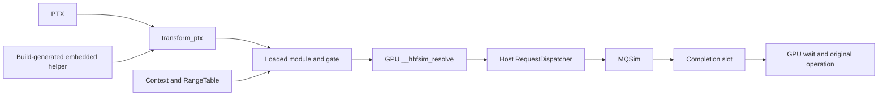

# Runtime function map

This is a navigation and responsibility map, not a test-pass report. Production behavior is grounded in B = `fc829992ecdc3ca68881656722b67a31067c5d33`. The phase-two optional parser section describes additive CPU tooling in `eval/eq1-eq4-implementation`; it does not install donor futures/TMA in production. S = `f4dc28b2671c01939d98e4a968e6fb37b2e364d9` remains a donor. Read [the knowledge-pack convention](../skills/00-reading-order.md) before interpreting historical names or results.

Update the affected rows when changing a mapped function. Paths refer to this worktree; named functions and their call relationships, not historical line numbers, are the navigation contract. The [frozen source ledger](../49-eval-audit/source-ledger.md) preserves exact B/S links and line spans for audited claims.

## Execution and data flow

The context binds the module before launch. A GPU request does not create a context. See [architecture](../skills/01-hbfsim-architecture.md) for fast-path branches and the separate timing/capacity address diagram.

## Public API and context ownership — application CPU

Source: [context.cpp](../../src/cuda_runtime/context.cpp), [context.hpp](../../src/cuda_runtime/context.hpp), [api.h](../../include/hbfsim/api.h).

| Functions / types | Responsibility and boundary |
|---|---|
| `hbfsim_context`, `ContextOperation` | Own resources and admit public operations; closing/quarantined owners cannot accept ordinary new work |
| `hbfsim_context_create`, `create_context` | Validate options/profile, construct control memory, establish CUDA/gate ownership and start/check daemon |
| `spawn_daemon`, `wait_for_heartbeat`, `process_status` | Launch the owned daemon, wait for its startup-ready heartbeat and check liveness; startup is not a GPU test |
| `validate_device_range_with_cuda` | Check current and pointer context/device, nonmanaged device allocation and requested extent |
| `hbfsim_register_device`, `register_device_with_gate`, `publish_range_to_gate` | Register physically backed timing ranges through a gate/publication transaction |
| `hbfsim_map_file` | Validate file/mode/domain/capability, reserve logical VMM span, stage/activate backing routing, publish capacity range and return pointer |
| `hbfsim_flush`, `submit_capacity_program` | Quiesce/validate the applicable lifecycle, persist dirty pages and submit explicit modeled capacity programs |
| `hbfsim_unregister` | Retire one exact range, flush capacity bytes when required, deactivate route and remove/release safely |
| `hbfsim_get_stats` | Read the existing counters; not a whole-model dynamic byte-coverage collector |
| `hbfsim_context_destroy`, `release_context`, `reap_or_terminate` | Close admission, perform checked retirement/cleanup, quarantine unsafe failure and reap only the owned child |

## Ranges, coverage and loaded-module identity — application CPU

| Source | Functions / types | Responsibility and boundary |
|---|---|---|
| [range_table.cpp](../../src/cuda_runtime/range_table.cpp) | `RangeTable::add`, `remove`, `lookup` | Validate nonoverlapping ranges, assign synthetic media intervals, publish transactionally and detect crossed bounds |
| [coverage.hpp](../../include/hbfsim/coverage.hpp) | `LaunchRangeSynchronizer` | Coordinate first launch, registration and retirement; admission lock extends through enqueue |
| [coverage.cpp](../../src/cuda_runtime/coverage.cpp) | `module_manifest_from_json`, `CoverageGate::add_module`, `add_range`, `check_launch` | Validate metadata, inspect actual argument ranges and classify modeled, rejected or opaque timing-backed work |
| [coverage.cpp](../../src/cuda_runtime/coverage.cpp) | `uninspectable_launch_decision` | Reject unsafe strict/capacity paths; existing timing-only policy can record an opaque unmodeled allowance |
| [module_identity.cpp](../../src/cuda_runtime/module_identity.cpp) | `identity_from_ptx`, `ModuleLoadTransactionStore::begin`, `take`, `end` | Recover and transfer exact PTX identity in a scoped one-shot load transaction |
| [module_identity.cpp](../../src/cuda_runtime/module_identity.cpp) | `ModuleIdentityRegistry::associate`, `lookup`, `erase` | Associate successful live module handles with identity; erase on corresponding successful lifecycle transition |
| [timing_binding.cpp](../../src/cuda_runtime/timing_binding.cpp) | `TimingBindingRegistry::add_module`, `activate`, `ready`, `ready_for_active` | Publish alias/generation for exact CUDA owner/domain and verify a module is ready |
| [timing_binding.cpp](../../src/cuda_runtime/timing_binding.cpp) | `quiesce`, `invalidate`, `finish_retire`, `erase_context` | Block new use, invalidate module controls and finish scoped retirement |
| [launch_gate.cpp](../../src/cuda_runtime/launch_gate.cpp) | `initialize_module_control`, `require_timing_binding`, `activate_timing_owner` | Initialize helper globals and refuse modeled execution with missing/stale bindings |
| [launch_gate.cpp](../../src/cuda_runtime/launch_gate.cpp) | `inspect_function_launch`, `inspect_kernel_launch`, `inspect_symbol_launch`, `approve` | Inspect supported driver/runtime entry points, apply policy and durably record the decision |
| [launch_gate.cpp](../../src/cuda_runtime/launch_gate.cpp) | `driver_launch`, `runtime_launch`, `kernel_launch`, `substitute_gated_launch` | Preserve launch/lookup ABI while routing supported entry points through the gate |
| [bpftime_attach_loader.cpp](../../src/cuda_runtime/bpftime_attach_loader.cpp) | `main` | Process-level bpftime attachment/session lifecycle; not the device resolver or TensorMap registry |

## Production PTX transformation and embedding — CPU/build time

| Source | Functions / types | Responsibility and boundary |
|---|---|---|
| [ptx_memory_op.cpp](../../src/ptxpass_hbf/ptx_memory_op.cpp) | `parse_offset`, `access_bytes`, `parse_memory_op`, `PtxMemoryOp` | Recognize the supported global load/store textual subset, predicates, widths and constant address offsets |
| [ptx_source.hpp](../../src/ptxpass_hbf/ptx_source.hpp) | `code_without_comments` | Shared line/block-comment scanner extracted verbatim from B's transform for phase-two reuse |
| [transform.cpp](../../src/ptxpass_hbf/transform.cpp) | `joined_statement`, `statement_is_open`, `unsupported_memory_instruction` | Scan logical statements, preserve `.loc` boundaries and classify unsupported memory families, including async global copies |
| [transform.cpp](../../src/ptxpass_hbf/transform.cpp) | `transform_ptx`, `replace_address` | Emit synchronous resolver/status/fault code before the selected native load/store; preserve its predicate/opcode |
| [transform.cpp](../../src/ptxpass_hbf/transform.cpp) | `has_compatible_device_target`, `append_device_helper` | Validate target/reserved symbols and embed the exact build helper |
| [plugin.cpp](../../src/ptxpass_hbf/plugin.cpp), [main.cpp](../../src/ptxpass_hbf/main.cpp) | `process_input`, `print_config`, `parameter_metadata`, `inject_module_identity`; CLI `main` | Package transformation, manifest and exact PTX identity for their respective integration paths |
| [EmbedDevicePtx.cmake](../../cmake/EmbedDevicePtx.cmake), [CMakeLists.txt](../../CMakeLists.txt) | `hbfsim_device_ptx`, `kEmbeddedDevicePtx` | Compile helper CUDA to PTX, strip module directives, generate the embedded header and rebuild consumers |

## Device helper — application's GPU lanes

Source: [hbf_device.cu](../../src/cuda_runtime/device/hbf_device.cu) and [hbf_device.cuh](../../src/cuda_runtime/device/hbf_device.cuh).

| Functions / types | Responsibility and boundary |
|---|---|
| `__hbfsim_control`, `__hbfsim_control_generation` | Loaded module's GPU-visible control alias and owner generation |
| `__hbfsim_resolve` | Validate ABI/generation, look up the range, derive a page, coalesce active same-page lanes, select timing/reference path and return a checked address |
| `find_range_index`, `access_supported`, `media_descriptor` | Binary-search sorted ranges; check permission/overflow/single-page extent; map to a full modeled media page |
| `resolved_address`, `ResolveResult` | Timing returns original address; capacity returns frame+offset; 16-byte result carries status |
| `system_acquire`, `system_release`, `system_compare_exchange` | CUDA system-scope shared-control publication/observation; not a general CUDA application memory model |
| `gpu_time_ns`, `bounded_sleep`, `poll_liveness`, `WaitState` | GPU-local timer/backoff, request deadline and observed-heartbeat-change checks |
| `reserve_request` | Bound admission and reserve a paired request/completion slot using exact sequences |
| `wait_for_completion` | Observe terminal exact-ID completion, recycle its slot, preserve precise failure and wait until arrival+scaled modeled duration |
| `resolve_leader` | Synchronous host request plus completion/deadline wait for one coalesced page group |
| `resolve_fast_or_hybrid` | Sample reference requests or inject GPU-local scalar/empirical timing; capacity does not enter this path |
| `hybrid_reference_sample`, `fast_transfer_ns`, `fast_service_ns` | Deterministic sampling and scalar timing arithmetic |
| `empirical_request_service`, `update_empirical_burst`, `empirical_cumulative_ns` | Validate/compute empirical marginal page service from the shared six-point cumulative curve |
| `__hbfsim_fault` | GPU trap on failed resolver status before the original access |

## Shared control and host dispatch — parent CPU / daemon CPU

| Source | Functions / types | Responsibility and boundary |
|---|---|---|
| [control_layout.hpp](../../src/host_service/control_layout.hpp) | `SharedControlHeader`, `SharedRangeRecord`, `ControlView::initialize`, `valid` | ABI 4 layout, offsets/geometry validation and initialization |
| [control_layout.hpp](../../src/host_service/control_layout.hpp) | `try_push_request`, `try_pop_request`, `try_publish_completion`, `try_consume_completion` | Paired sequence-ring operations; request/completion bodies precede release publication |
| [control_layout.hpp](../../src/host_service/control_layout.hpp) | `begin_capacity_handoff`, `try_capacity_handoff`, `complete_capacity_handoff`, `capacity_handoff_result`, `release_capacity_handoff` | Exact ticket/request ownership of parent-worker page preparation and media plan |
| [protocol.hpp](../../include/hbfsim/protocol.hpp) | `HbfRequest`, `HbfCompletion`, `PageEntry`, `SequenceRing` | Fixed wire records and generic ring; generic `ControlHeader` is not runtime `SharedControlHeader` |
| [main.cpp](../../src/host_service/main.cpp) | `main` | Validate sealed control memfd/profile/report path, build MQSim dispatcher and publish startup/heartbeat |
| [request_dispatcher.cpp](../../src/host_service/request_dispatcher.cpp) | `prepare_host_dispatch` | Resolve capacity through parent handoff before deciding media work; reject malformed explicit programs |
| [request_dispatcher.cpp](../../src/host_service/request_dispatcher.cpp) | `prepare_capacity_media_dispatch`, `PreparedDispatch` | Zero actions for hit; demand read on miss; victim program before read for dirty eviction |
| [request_dispatcher.cpp](../../src/host_service/request_dispatcher.cpp) | `RequestDispatcher::poll_once`, `submit_next`, `publish`, `fail_all` | Match internal IDs to original tickets, order actions, accumulate time and publish exact terminal failures before global fault |

## Capacity ownership, routing and bytes — parent application's CPU/CUDA context

| Source | Functions / types | Responsibility and boundary |
|---|---|---|
| [capacity_runtime.cpp](../../src/cuda_runtime/capacity_runtime.cpp) | `frame_count`, `CapacityRuntime::create`, constructor | Validate shared frame budget and own VMM pool/cache/router/bounce/service/worker |
| [capacity_runtime.hpp](../../src/cuda_runtime/capacity_runtime.hpp) | `CapacityMapping` | Own backing extent, logical reservation, synthetic page interval and publication token |
| [capacity_runtime.cpp](../../src/cuda_runtime/capacity_runtime.cpp) | `start_worker`, `stop_worker`, `host_to_frame`, `frame_to_host` | Establish worker CUDA domain and perform checked physical frame transfers |
| [capacity_runtime.cpp](../../src/cuda_runtime/capacity_runtime.cpp) | `flush`, `stop`, `release_cuda_resources` | Explicit persistence, worker stop/join and checked resource release; stop alone does not flush |
| [vmm.cpp](../../src/cuda_runtime/vmm.cpp) | `VmmRange::reserve_logical`, `VmmRange::release` | Reserve/free virtual address span without payload mapping at the logical address |
| [vmm.cpp](../../src/cuda_runtime/vmm.cpp) | `VmmFramePool::create`, `release`, `CudaVmmDriver` | Allocate/map a bounded physical device-memory pool through the driver abstraction |
| [hbm_cache.cpp](../../src/cuda_runtime/hbm_cache.cpp) | `HbmCache::resolve`, `publish`, `mark_dirty`, `free_frame` | Resident page/frame lookup, publication, dirtiness and free-frame selection |
| [hbm_cache.cpp](../../src/cuda_runtime/hbm_cache.cpp) | `begin_eviction_locked`, `cancel_eviction`, `complete_eviction`, `reclaim_eviction` | CLOCK selection and generation-checked eviction/retry operations |
| [capacity_backing_router.cpp](../../src/host_service/capacity_backing_router.cpp) | `stage`, `activate`, `cancel`, `deactivate`, `admit` | Transactional routing publication and in-flight route ownership; 64 entries, distinct from shared range capacity |
| [capacity_backing_router.cpp](../../src/host_service/capacity_backing_router.cpp) | `read_page`, `write_page`, `flush` | Convert unique synthetic pages to the correct backing file's local page/extent |
| [backing_store.cpp](../../src/host_service/backing_store.cpp) | `BackingStore`, `page_window`, `read_page`, `write_page`, `flush` | Bound file offsets, complete partial system calls, zero-pad final read page and persist valid extent bytes |
| [capacity_page_service.cpp](../../src/host_service/capacity_page_service.cpp) | `CapacityPageService::resolve`, `writeback`, `flush` | Prepare resident bytes, rollback failed dirty eviction and return explicit modeled media actions |
| [capacity_worker.cpp](../../src/host_service/capacity_worker.cpp) | `CapacityWorker::run`, `stop`, `flush` | Claim capacity handoffs, call page service, publish exact completion and join safely; no readahead producer |
| [page_directory.cpp](../../src/protocol/page_directory.cpp) | `PageDirectory::lookup_or_reserve`, `publish`, `resolve`, `mark_dirty`, `begin_writeback`, `evict` | Separate page-state utility with its own tests; do not substitute its presence for `HbmCache` live residency or assume the device bypasses the parent worker |

## Media engine and profiles — daemon or offline CPU

| Source | Functions / types | Responsibility and boundary |
|---|---|---|
| [profile.cpp](../../src/profile/profile.cpp) | `load_profile`, `validate_profile`, `Profile` | Shared named-profile parsing/validation, geometry and empirical metadata; no second experiment parser |
| [mqsim_online.cpp](../../src/mqsim_adapter/mqsim_online.cpp) | `configure_mqsim`, `ArrivalInjector` | HBF media interface, geometry/NAND parameters and simulated arrival events |
| [mqsim_online.cpp](../../src/mqsim_adapter/mqsim_online.cpp) | `MqsimOnlineEngine::submit`, `Impl::flush_staged` | Validate/queue descriptors and deterministically register arrival events |
| [mqsim_online.cpp](../../src/mqsim_adapter/mqsim_online.cpp) | `submit_to_device`, `dispatch_to_device`, `release_admission_slots` | Bounded in-device QD, queued admission and completion callback without reentrant segmentation |
| [mqsim_online.cpp](../../src/mqsim_adapter/mqsim_online.cpp) | `run_next_completion`, `pending`, `current_time_ns` | Incremental event advancement and model counters/time; not host wall time |
| [mqsim_online.cpp](../../src/mqsim_adapter/mqsim_online.cpp) | `run_mqsim_trace` | Explicit trace reader and read/write convention conversion; not a generic fio importer |
| [calibrator.cpp](../../src/hybrid/calibrator.cpp) | `fast_service_ns`, `HybridSampler::reference`, `Calibrator::observe`, `estimate` | CPU analytical/sample utilities; their existence does not imply a new live adaptive feedback loop |
| [hbf_mqsim_bench.cpp](../../benchmarks/mqsim/hbf_mqsim_bench.cpp) | `main` | Synthetic size/pattern/fixed-arrival media benchmark and summaries; no physical SSD measurement |

## Adapters, offline tools and reporting — CPU unless a live workload is explicitly launched

| Source | Functions / types | Responsibility and boundary |
|---|---|---|
| [hbfsim_extension.cpp](../../adapters/vllm/hbfsim_extension.cpp) | `hbfsim_vllm_session_create`, `hbfsim_vllm_register_storage`, `hbfsim_vllm_session_close` | Narrow native bridge to context creation, physically backed timing registration and cleanup |
| [hbfsim_loader.py](../../adapters/vllm/hbfsim_loader.py) | `TimingConfig.from_mapping`, `_discover_storages`, `register_model_storages`, `HbfSimModelLoader.load_model` | Validate configuration, discover/deduplicate finalized storages and register selected extents |
| [triton_binding.py](../../adapters/vllm/triton_binding.py) | `TritonVariantBinder.on_kernel_load`, `install_triton_binding` | Bind the original function to rewritten same-PTX/same-name variant with a manifest |
| [prepare_triton_ptx.py](../../adapters/vllm/prepare_triton_ptx.py) | `stage_ptx`, `transform_one` | Preserve/cache exact PTX identity and call transformer on selected kernel |
| [run.py](../../adapters/vllm/run.py) | `configure_environment`, `base_manifest`, `main` | Set local caches/report metadata and invoke deterministic `LLM.generate`; configured batch is not actual per-step active sequences |
| [model_inventory.py](../../adapters/vllm_capacity/model_inventory.py) | `ModelInventory`, `_tensor`, `expert`, `compact_tensor_accesses` | Read supplied config/tensor identity and complete equal-sized experts; fixed inventory page unit 16,384 bytes, not automatic checkpoint scanning |
| [placement_policy.py](../../adapters/vllm_capacity/placement_policy.py) | `ClockCache`, `LruCache`, `BeladyCache`, `make_policy` | Offline complete-expert placement; Belady is a future-informed oracle |
| [trace_replay.py](../../adapters/vllm_capacity/trace_replay.py) | `load_trace`, `capacity_geometry`, `replay_cell`, `run_timing_engine` | Validate supplied accesses, apply legacy object ratios and summarize modeled demand; no closed device/KV/workspace rho budget |
| [trace_validation.py](../../adapters/vllm_capacity/trace_validation.py) | `route_identity`, `validate_trace` | Check trace/result identity and completeness; does not capture missing routing |
| [hbf_trace_timing.cpp](../../benchmarks/replay/hbf_trace_timing.cpp) | `run_reference`, `main` | Submit then complete each demand page serially; not concurrent live decode time |
| [prefetch_model.cpp](../../src/prefetch/prefetch_model.cpp) | `MediaServers::issue`, `StagingBuffer`, `simulate_prefetch`, `PrefetchStats::achieved_accuracy` | Standalone analytical prefetch/buffer model; not linked to the default runtime or a GPU producer |
| [coverage_writer.cpp](../../src/reporting/coverage_writer.cpp) | `CoverageWriter::append`, `try_append_coverage`, `coverage_decision_permits_launch` | Record policy decisions; reporting failure must not silently authorize a modeled launch |
| [durable_append.cpp](../../src/reporting/durable_append.cpp) | `append_durable_line`, `lock_fd`, `sync_fd`, `close_checked` | Serialize record writes and file/directory durability; not evidence that recorded scientific claims are true |
| [validate_results.py](../../scripts/eval/validate_results.py) | `validate_rows`, `validate_manifest`, `load_validated` | Check numerical schema/provenance/raw hashes and strict no-MOCK boundary |
| [render_figures.py](../../scripts/eval/render_figures.py) | `metric_points`, `summarize`, `plot_lines`, `plot_heatmap`, `render` | Exact series/cell grouping and one preview/final renderer; reject incomplete required grids |

## Phase-two optional PTX parser — CPU analysis only

This section describes C2 additions after B. The `hbfsim_eval_ptx` library is optional and is not linked into `hbfsim_core`. Production `transform_ptx` still emits the B synchronous resolver path; parser acceptance must never remove its async unsupported coverage by itself.

| Source | Functions / types | Responsibility and readiness |
|---|---|---|
| [ptx_source.hpp](../../src/ptxpass_hbf/ptx_source.hpp) | `code_without_comments` | Shared scanner extracted from B without changing the production call behavior |
| [ptx_ir.hpp](../../src/ptxpass_hbf/ptx_ir.hpp), [ptx_ir.cpp](../../src/ptxpass_hbf/ptx_ir.cpp) | `parse_module`, `Module::function`, `Instruction`, `BasicBlock`, `MemoryInstruction` | CPU IR with source locations, defs/uses, branch targets and optional memory/async records; rejects unproved packed syntax and unterminated comments |
| [ptx_async_op.hpp](../../src/ptxpass_hbf/ptx_async_op.hpp), [ptx_async_op.cpp](../../src/ptxpass_hbf/ptx_async_op.cpp) | `parse_async_instruction`, `TmaInstruction`, `BarrierInstruction`, `BulkGroupInstruction`, `TensorMapInstruction` | Parse supported candidate instruction grammar; no native/model completion or descriptor lifetime is executed |
| [IR gold test](../../tests/cpu/ptx_ir_gold_test.cpp) | Decorated multiline loads and rejected packing/comment cases | CPU regression; the [targeted log](../../results/gold/ptx-parser/packing-green.log) records the phase-two parser run, not a full phase regression or GPU test |
| [Future gold counterexample](../../tests/cpu/ptx_future_gold_test.cpp) | Donor predication and unproved control-flow cases | Expected donor RED is in [red.log](../../results/gold/async-counterexample/red.log); analysis repair/production integration are separate gates |

## Donor-only functions that are not production B

See [async knowledge](../skills/04-cuda-async-cpasync-tma.md) and [S source ledger](../49-eval-audit/source-ledger.md). `transform_futures`, `transfer_block`, `analyze_async_objects`, `transform_tma`, `DeviceFuture`, `__hbfsim_future_issue/poll/wait`, and `__hbfsim_tma_*` must not be assumed to have current runtime callers. The full future/control/context/loader/pointer-registry/embed dependency unit must be ported and validated together before a production claim. X routing materialization and callback compatibility now have bounded CPU-tested ports below. Runtime speculative prefetch and thermal-controller symbols remain separate donor work.

## Verification boundaries

This map is checked against local paths and source symbols, with donor symbols checked in the frozen Git object. The [GOLD-0 execution manifest](../../results/gold/base/frozen-config/execution.json) records the fresh 42-test CPU baseline; [pipeline log](../../results/gold/base/eval-pipeline.log) records 20 pipeline tests. Topic documents link meaningful tests by behavior. No GPU/storage payload experiment was run for this map, and no static map or test count closes hardware fidelity, whole-model coverage or general async semantics.

## Evaluation future state oracle — CPU only

[shadow_future.hpp](../../include/hbfsim/shadow_future.hpp) and
[shadow_future.cpp](../../src/cuda_runtime/shadow_future.cpp) build only into
`hbfsim_eval_future` when evaluation tools are enabled. `issue` allocates a
bounded outstanding request with a finite deadline; `complete` schedules one
terminal arrival; `refresh_record` chooses the earlier modeled arrival/deadline;
`poll` observes readiness; `wait` advances oracle time and charges dependency or
ordering wait; `consume` accepts one ready value. `drain` selects the requested
scope. `ShadowFuture` is a 64-byte **CPU oracle record**, not the donor's
64-byte device future ABI. No production GPU helper calls this machine, and
its capacity label proves no frame lease, transfer or GPU memory visibility.

## Checkpoint inventory and capacity budgets — evaluation CPU

| Source | Function | Responsibility |
|---|---|---|
| [inventory_checkpoint.py](../../scripts/eval/inventory_checkpoint.py) | `inventory_checkpoint` | Read actual GGUF metadata, split supported packed expert projections into checked source extents, classify every tensor and preserve checkpoint identity without payload hashing |
| [inventory_checkpoint.py](../../scripts/eval/inventory_checkpoint.py) | `validate_inventory` | Reconcile embedded config, KV shape, tensor extents, expert identities and source segments, bytes and logical page accounting |
| [budget_fast_tier.py](../../scripts/eval/budget_fast_tier.py) | `budget_fast_tier` | Deduct explicit resident/KV/workspace/safety bytes; report raw and whole-expert achieved rho, unused capacity and padding separately from legacy ratio and observed cache behavior |

## Ordinary-load future analysis — evaluation CPU

[ptx_analysis.cpp](../../src/ptxpass_hbf/ptx_analysis.cpp):
`supported_instruction` admits the bounded scalar straight-line subset;
`analyze_futures` rejects unknown control/def-use behavior before analysis;
`transfer_block` retains conditional may-pending futures, records first-use
waits and pre-clobber/ordering drains. `FuturePlan::exact_safe` means the CPU
analysis subset passed, not that an emitted module or GPU runtime passed gold.

## Optional MQSim event observations — evaluation CPU

`MqsimOnlineEngine::enable_observations` in
[mqsim_online.cpp](../../src/mqsim_adapter/mqsim_online.cpp) opts in before any
submission. `Impl::observe` records original arrival metadata, current event
time and held-slot QD at arrival/admission/completion boundaries.
`take_observations` drains the records once. The raw media callback and existing
bandwidth-adjusted reported completion are separate fields; neither is a NAND
command-start probe. Disabled observation does not enqueue diagnostic records.

## Concurrent media replay — independent evaluation executable

[hbf_concurrent_trace_timing.cpp](../../benchmarks/replay/hbf_concurrent_trace_timing.cpp):
`read_requests` validates integer clocks, unique IDs, request metadata and known
resource/channel mapping. `replay` stages fixed arrivals or replenishes an
explicit closed-loop QD window, then reconciles returned completions with
observed arrival/admission/media events. It reports queue/service/interface
spans, per-request residual and time-weighted held-slot QD. `publish` atomically
creates a new JSON artifact without replacing a previous result. Existing
`hbf_trace_timing` remains the separate serial tool. Input/build/raw hashes are
required in the outer experiment manifest; nested raw JSON is not measured CSV.

## Resumable scheduler and replay provenance

| Source | Functions | Responsibility |
|---|---|---|
| [run_matrix.py](../../scripts/eval/run_matrix.py) | `main` | Read the frozen CSV, plan or run explicitly bounded registered tasks, retain attempts and resume state |
| [resource_guard.py](../../scripts/eval/resource_guard.py) | `ResourceGuard` | Class-specific GPU/storage snapshots and refusal; NVML ownership retains exact identity for an owned unreaped child, and unknown/reused identities reject; project locks do not own foreign resources |
| [run_manifest.py](../../scripts/eval/run_manifest.py) | `atomic_json`, `process_identity`, `signal_identity`, `artifact_inventory` | Durable publication, exact process identity, pidfd cleanup and regular confined artifact inventory |
| [export_results.py](../../scripts/eval/export_results.py) | `validate_attempt`, `collect_done`, `export` | Apply full artifact/receipt/provenance/schema checks before DONE and export through the unchanged strict validator |
| [replay_arrivals.py](../../scripts/eval/replay_arrivals.py) | `freeze_file`, `run_replay`, `validate_raw` | Freeze small input hashes and actual build/argv, run CPU media tool, reconcile serialized lifecycle/arrivals/QD and publish a validated-raw manifest; no scheduler DONE or hardware claim |

## Storage split and routing metadata — CPU preparation

| Source | Functions | Responsibility |
|---|---|---|
| [freeze_storage_split.py](../../scripts/eval/freeze_storage_split.py) | `load_pairs`, `prepare_split`, `verify_bundle` | Preserve actual matrix pairs and calibration roles; publish immutable small metadata and return verified byte snapshots |
| [freeze_storage_split.py](../../scripts/eval/freeze_storage_split.py) | `fit_inputs`, `freeze_profile`, `heldout_inputs` | Produce calibration-only views, bind caller-supplied fit receipts and new validation IDs before heldout views; no fit sandbox or scientific/hardware validation is asserted |
| [routing_metrics.py](../../scripts/eval/routing_metrics.py) | `compose_routes`, `summarize_routes`, `analyze_routes` | Align decode steps, drop ended members, retain seeded tie order, calculate union/frequency/entropy/Gini/Jaccard/reuse, independently shuffle whole top-k sets and report a separate analytical null |
| [routing_metrics.py](../../scripts/eval/routing_metrics.py) | `load_inventory`, `main` | Reuse validated metadata inventories, bind the exact member/index snapshots and output separate series; trace composition does not certify real capture or serving timing |

`MqsimOnlineEngine::run_next_completion_until` in
[mqsim_online.cpp](../../src/mqsim_adapter/mqsim_online.cpp) uses optional no-op
clock markers to stop for external compute events or return a reported-ready
completion. It does not implement a compute DAG or prefetch policy itself.

## Acquisition and causal service controllers — evaluation CPU

| Source | Functions/types | Responsibility |
|---|---|---|
| [collect_storage.py](../../scripts/eval/collect_storage.py) | `CollectorGuard`, `DirectReader`, `acquire`, `collect` | Prove exclusive read authorization/parent lock ownership, bound aligned direct reads and arrivals, retain interruption diagnostics and exact request accounting; acquisition alone is not a scientific gate |
| [hbf_mqsim_service.cpp](../../benchmarks/replay/hbf_mqsim_service.cpp) | `send`, `main` | Own one optional native engine, validate batched reads and expose bounded completion/observation JSON lines with exact finish conservation |
| [mqsim_service.py](../../scripts/eval/mqsim_service.py) | `MqsimService.submit`, `until`, `finish`, `close` | Record native protocol, check clock and three-event lifecycle, validate native exit and clean up only the directly owned child |
| [prefetch_replay.py](../../scripts/eval/prefetch_replay.py) | `validate_nodes`, `replay` | Validate complete composed batches and feasible whole-expert capacity; coordinate visible-route prediction, pinned compute, shared service, LRU reservations and timely/late/useless accounting |
| [run_prefetch.py](../../scripts/eval/run_prefetch.py) | `prepare`, `run` | Bind immutable inventory/budget/route/compute identities, run three matched native policies and reconcile extra traffic; outputs remain projection or MOCK |
| [trace_collector.py](../../adapters/vllm_capacity/trace_collector.py) | `JsonlTraceCollector.emit_request`, `summary` | Preserve returned route/request/tensor identities with strict IDs and whole-request validation; materialization is not capture authentication |
| [routed_capture_compat.py](../../adapters/vllm_capacity/routed_capture_compat.py) | `DeferredCaptureBinding`, `install_vllm_routed_experts_deferred_binding` | Explicit lazy reversible in-process callback binding for the audited donor API; no installed vLLM modifications or hardware gold |
| [trace_validation.py](../../adapters/vllm_capacity/trace_validation.py) | `main` | Keep missing native/repeat controls INCOMPLETE and TEST_ONLY sources distinct; consistency checks cannot authenticate real capture |
| [storage_arrivals.py](../../scripts/eval/storage_arrivals.py) | `convert_records`, `convert` | Verify complete acquisition ledgers and freeze exact actual-submit times/offsets/bytes for fixed MQSim arrival replay; preserve source-ID mapping and TEST_ONLY attribution |
| [hbf_device.cuh](../../src/cuda_runtime/device/hbf_device.cuh) | `EvalDelayConfig`, `eval_delay_action`, `eval_delay_remaining`, `eval_delay_clock_interval` | Module-local opt-in known-delay contract, separate from ABI4; zero magic off, registered TIMING reads only, bounded delay and zero-delay no-wait control |
| [hbf_device.cu](../../src/cuda_runtime/device/hbf_device.cu) | `__hbfsim_resolve` experiment branch | After existing range/media checks, retain grouping/translation and record a bounded synthetic wait; default dispatch remains the original synchronous path |
| [hbf_dependent_delay.cu](../../benchmarks/cuda/hbf_dependent_delay.cu) | `hbf_dependent_delay`, `main` | K-hop single-lane-per-warp dependency, checksum/globaltimer/Event/block intervals, trusted transform/load/binding and explicit module config |
| [run_gpu_delay.py](../../scripts/eval/run_gpu_delay.py) | `make_plan`, `analyze`, `execute` | Bind one CSV cell to matched controls and raw dimensions; guard GPU exclusivity and retain immutable coverage/timing diagnostics without matrix-wide gold claims |
| [audit_sass_mapping.py](../../scripts/eval/audit_sass_mapping.py) | `collect_mapping_artifacts` | Freeze representative compiled inputs and disassemblies once, verify cache/build/tool identities, and keep instruction collection distinct from semantic mapping proof |
| [replay_storage_pair.py](../../scripts/eval/replay_storage_pair.py) | `run_pair`, `validate_pair`, `compare_steady` | Freeze acquisition/profile identity; replay explicit observed-arrival or closed-policy modes; recompute separate steady-window metrics from immutable ledgers; no physical/scientific gate promotion |
| [hbf_device.cu](../../src/cuda_runtime/device/hbf_device.cu) | `eval_delay_clock_wait`, `eval_delay_control_ready` | Keep cached finite clock-only experiment wait separate from common pre/post mapped-control safety checks |
