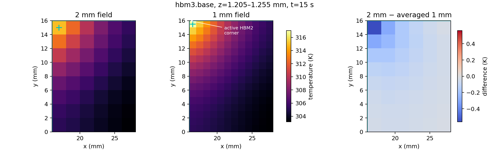

# P2 local-field diagnostic: R02 2 mm versus R03 1 mm

Date: 2026-09-20  
Scope: read-only, `hbm3.base`, 15 s, physical z layer 4 only  
Status: `NUMERICAL_ACCURACY_LIMIT`; no `CONFIRMED_BUG` found

## Answer

The reported 2.069 K hotspot difference is mostly a spatial-sampling effect,
with a smaller resolved-field difference. It is not a 2.069 K shift of the
whole HBM base and it does not currently indicate an indexing, component-map,
or transport implementation bug.

After volume-averaging each 2x2 block of the 1 mm result onto the matching
2 mm cell:

- 1.5065 K (72.81%) is the fine-cell peak above its 2x2 average. This is the
  hotspot-sampling part that a 2 mm cell cannot represent.
- 0.5625 K (27.19%) remains between the averaged 1 mm peak cell and the 2 mm
  peak cell. This is a spatial-discretization difference in the solved field.
- The `hbm3.base` volume-weighted mean changes by only 0.09994 K, from
  306.29008 K to 306.39003 K. Across all 48 coarse footprints, the mean
  absolute coarse-versus-averaged-fine difference is 0.09994 K and the maximum
  is 0.5625 K.

The evidence supports `NUMERICAL_ACCURACY_LIMIT`, rather than
`CONFIRMED_BUG`. It does not prove that the 1 mm absolute temperature is
physically accurate: R03 remains `REFERENCE_UNQUALIFIED`, and neither this
diagnostic nor the existing spatial comparison establishes Model Freeze.

## Location and source context

The target is layer 4, z = 1.205--1.255 mm. `hbm3.base` spans x = 16--28 mm
and y = 0--16 mm.

| Quantity | R02, 2 mm | R03, 1 mm |
|---|---:|---:|
| hotspot | 314.966 K | 317.035 K |
| cell | `n4_7_8` | `n4_15_16` |
| cell center | (17.0, 15.0, 1.230) mm | (16.5, 15.5, 1.230) mm |
| hotspot minus component mean | 8.67592 K | 10.64497 K |

Both grids therefore select the same physical corner. The four 1 mm cells
inside the hottest 2 mm footprint are 315.473, 314.263, 317.035, and
315.343 K; their volume average is 315.5285 K. The 1 mm peak is concentrated
in the half of that footprint closest to the corner.

During the completed 14.5--15.0 s source interval, all 12 `hbm2` dies dissipate
64 W total. The `hbm2` footprint x = 0--16 mm, y = 16--28 mm touches the hot
corner of `hbm3.base` at (16,16) mm. In the same interval, `hbm3` dies,
`hbm3.base`, and the GPU have zero applied power. `hbm3.die0` occupies the same
planar footprint as its base, begins 8 um above it, and is unpowered; the GPU
has a 4 mm planar gap and is also unpowered. This is consistent with a steep,
localized temperature gradient carried from the active neighboring HBM2
stack, although physical validation of that gradient remains outside this
diagnostic.

The two temperature panels use one common color scale. Cyan plus signs show
each grid's hotspot. The difference panel is `2 mm - volume-averaged 1 mm`;
the most negative cell is -0.5625 K at the shared hot footprint.

## Method and invariants

Only `field_4` was read. The R02 registered plain raw stream and the R03
EQ3TMK1 lossless stream were each read through EOF. Their full layer hashes,
byte counts, row counts, and 5000-frame coverage were checked before retaining
frame 750 (15 s). R03's codec footer was therefore also validated. The
selected component has one common z layer and the physical component bounds
match across grids.

Every 2 mm component cell mapped to exactly four contained 1 mm cells. Each
projection used a volume-weighted average. The peak decomposition obeyed the
identity

`fine peak - coarse peak = (fine peak - projected fine peak) + (projected fine peak - coarse peak)`

with a 0 K numerical residual. These percentages decompose the difference
between two computed fields; they are not an error budget against continuum
truth and do not prove that 1 mm is exact. No temperature, timestamp, raw field, solver,
equation, source trace, or acceptance threshold was changed.

The two runs' `normalized.json` inputs have the same SHA-256,
`7a62356faef94e9d16391c39a1e6ccf81d284843c0d9c3ea0d9471d0d364ce06`.
Both observation receipts declare 0.001 K field-output quantization. That
quantization can contribute only millikelvin-scale rounding here and cannot
explain the 0.5625 K projected-field difference.

## Evidence

- Preflight:
  `eq3_thermal/plans/decision-execution-v2/P2_LOCAL_FIELD_PREFLIGHT.md`
- Machine-readable result:
  `eq3_thermal/plans/decision-execution-v2/points/p2-local-field-hbm3base-15s-v2/local_field.json`
- Safety-run receipt:
  `eq3_thermal/plans/decision-execution-v2/points/p2-local-field-hbm3base-15s-v2/result.json`
- Static figure and receipt:
  `eq3_thermal/plans/decision-execution-v2/points/p2-local-field-figure/`
- Initial caller setup failure, before any analysis program started:
  `eq3_thermal/plans/decision-execution-v2/points/p2-local-field-hbm3base-15s-setup-failed/FAILED.json`

The successful extraction used 1009 MiB sampled aggregate RSS, 9.79 s wall
time, one CPU, and no GPU. The figure used 108 MiB sampled aggregate RSS and
4.35 s wall time.

## Limits

This is a one-frame, one-layer diagnostic at the registered worst hotspot. It
separates subcell sampling from the difference between the two discrete fields,
but cannot identify continuum truth or a convergence order. A moving hotspot
maximum must not be used as a Richardson-like same-observable convergence
estimate. Full-window D2 scores and the existing energy and domain checks
remain separate evidence, and R03 remains unqualified.
