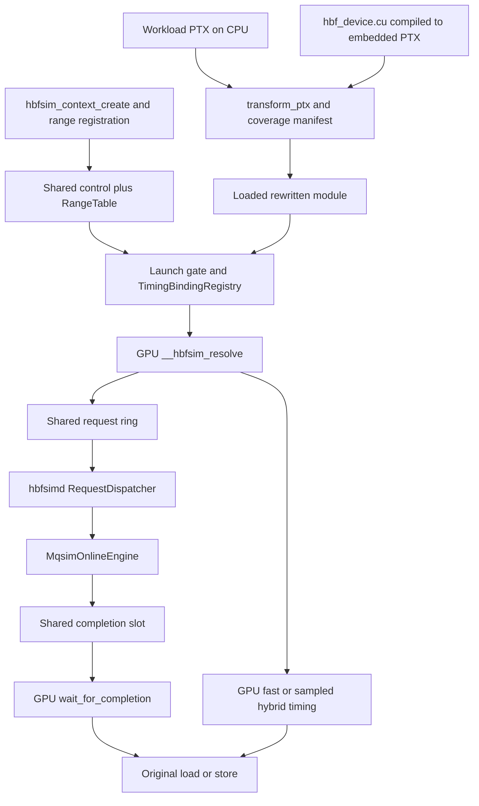
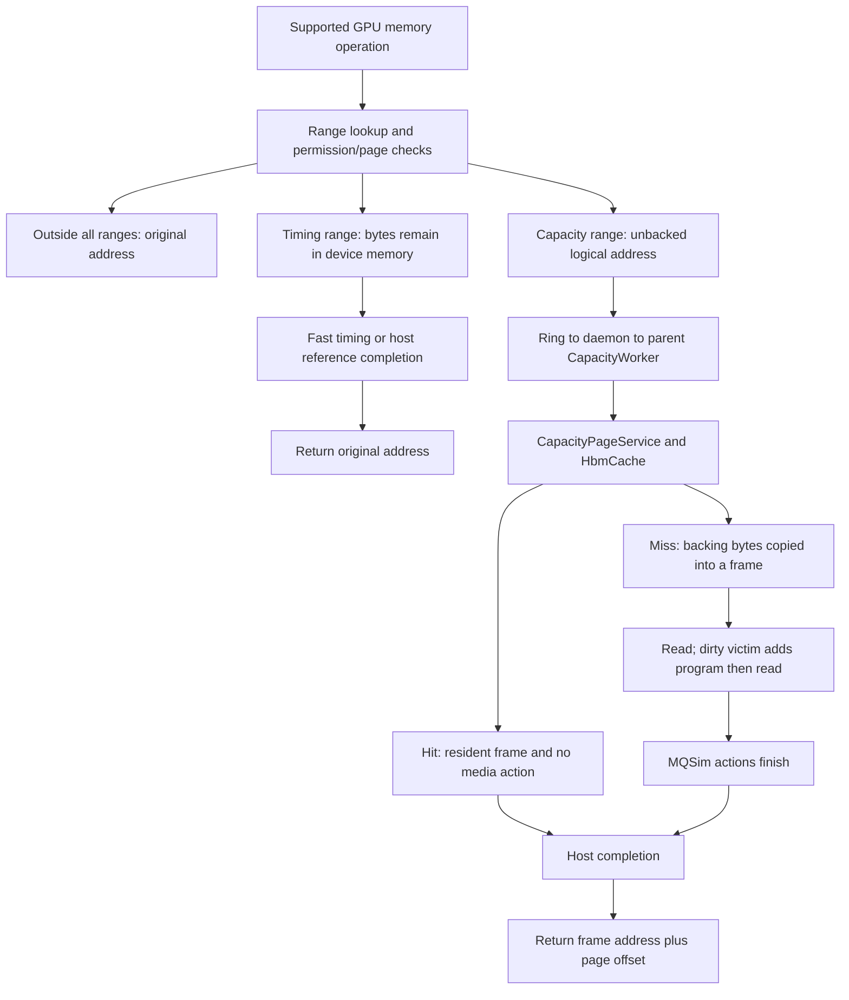

# HBFSim architecture at the audited base

## Purpose

Explain where data, control and modeled time move in the executable implementation, before opening individual modules.

## Scope

Snapshot B and evidence labels are defined in [reading order](00-reading-order.md). HBFSim executes a workload on a physical GPU and changes selected accesses through software instrumentation. It is not a cycle model of an SM, a physical HBF device, or an implementation of the complete HBF hardware protocol.

## Key concepts

An explicit registered range selects modeled addresses. Timing registration retains physical device-memory backing; capacity registration reserves a logical address and supplies backing-file bytes through bounded frames. `reference`, `fast` and sampled `hybrid` select timing behavior, with a separate restriction: capacity always follows the host reference path. One context publishes one profile and one control generation.

## Important files

[Public API](../../include/hbfsim/api.h), [context](../../src/cuda_runtime/context.cpp), [transform](../../src/ptxpass_hbf/transform.cpp), [device helper](../../src/cuda_runtime/device/hbf_device.cu), [daemon](../../src/host_service/main.cpp), [dispatcher](../../src/host_service/request_dispatcher.cpp), [MQSim adapter](../../src/mqsim_adapter/mqsim_online.cpp), and [build graph](../../CMakeLists.txt).

## Important structs/classes/functions

`hbfsim_context` owns the profile, sealed shared control mapping, daemon identity, range table, CUDA-domain binding and optional `CapacityRuntime`. `TransformResult` carries rewritten PTX and static coverage. `ResolveResult` returns address plus status. `RequestDispatcher` associates original GPU tickets with internal media requests. `CapacityPageService` decides whether an access requires zero, one or two media actions.

## Call path / data path

The context/binding path prepares the GPU helper before the first modeled launch; it is not a CPU call made by every rewritten instruction.

The capacity cache is checked in the parent worker. Even a hit takes the shared-ring/host path in B; zero media work is not zero emulator overhead.

## CPU-side vs GPU-side execution context

The application CPU owns registration, CUDA lifetimes and capacity transfers. The daemon CPU owns MQSim and its modeled clock. The GPU thread issuing the original instruction also executes the resolver and waits. B has no dedicated simulator SM. Device `%globaltimer`, host steady clock, MQSim time and whole-kernel CUDA Events have different roles; never subtract unrelated absolute clocks.

## Invariants

Range publication and launch admission must agree. The helper's alias and generation must match the active CUDA context/device. Physical copies and modeled completion must both succeed before a capacity resolver returns success. A failed or stale completion cannot supply an address. Dirty state must be flushed or retained under failure handling before resources are released.

## Supported behavior

Explicit timing-backed ranges, supported load/store rewriting, one-context fast/hybrid/reference selection, shared bounded demand capacity cache, exact completion tickets, multi-file routing, and CPU offline evaluation tools are present in source. Physical device-memory technology must come from the actual testbed manifest, not the name `HbmCache`.

## Explicitly unsupported behavior

No full GPU scheduler/scoreboard/cache hierarchy model, SASS rewriting, physical HBF equivalence, base runtime prefetch, donor future/TMA support or thermal feedback. Hypothetical profiles predict a conditional scenario; running their model on real hardware does not make the target device real.

## Common failure modes

Confusing timing selection with address mode; applying the timing-only empirical curve to capacity results; treating host round-trip time as target flash latency; assuming cache hits bypass the host; or treating static coverage counts as whole-model dynamic byte coverage.

## Tests proving the behavior

Existing sources: [context lifecycle](../../tests/cpu/context_lifecycle_test.cpp), [device ABI](../../tests/cpu/device_helper_abi_test.cpp), [daemon protocol](../../tests/integration/daemon_protocol_test.cpp), [capacity dispatch](../../tests/cpu/capacity_dispatch_test.cpp), [MQSim online](../../tests/integration/mqsim_online_test.cpp), and [public lifecycle](../../tests/integration/public_cuda_lifecycle_test.cpp). CPU/fake-driver tests establish bounded component behavior when run; they do not establish live GPU fidelity. No runtime test was run for this document.

## What not to change casually

The ownership order, fail-closed lifecycle, range-table identity, common profile parser and daemon/helper compatibility. Keep offline prefetch and replay libraries behind `HBFSIM_ENABLE_EVAL_TOOLS`, default OFF, as in the build graph.

## Related docs

[Function map](../architecture/runtime-function-map.md), [control ABI](05-device-helper-and-control-abi.md), [capacity](07-capacity-address-translation.md), [current capability audit](../49-eval-audit/current-capability-audit.md), and [historical hybrid design](../superpowers/specs/2026-08-09-hbfsim-hybrid-design.md).
